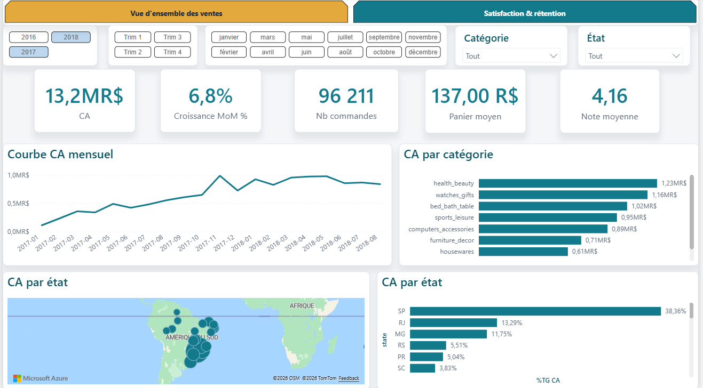
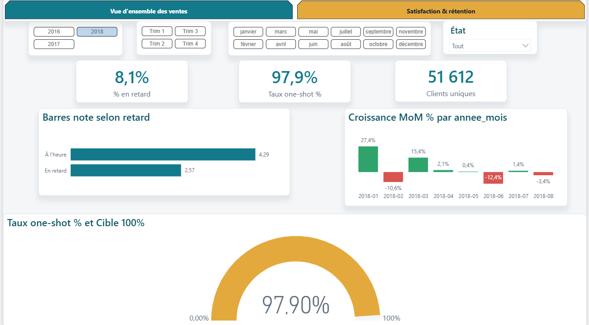
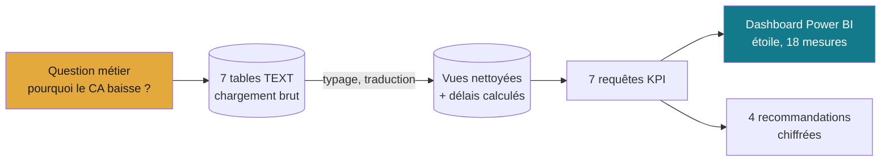

# Projet 01 — Analyse des ventes e-commerce (Olist)

> **« Les ventes ont chuté — pourquoi ? »** Le travail d'un Data Analyst ne commence
> pas par Excel mais par une **question métier**. Cette analyse part d'une baisse
> constatée, l'explique avec les données, et débouche sur des **recommandations
> chiffrées et actionnables**.

Données : **Olist Brazilian E-Commerce** (~100 k commandes, 2016-2018).

## 📸 Aperçu du dashboard

**Page 1 — Vue d'ensemble des ventes**


**Page 2 — Satisfaction & rétention**


## 🔎 Réponse en 4 points (voir [docs/insights.md](docs/insights.md))

1. **La baisse est réelle mais modérée** : pic à 978 k R$ (mai 2018), puis −14 %
   sur 3 mois. Le pic de nov. 2017 = Black Friday (saisonnalité).
2. **Ce n'est PAS un problème de qualité** : pendant la baisse, les délais se sont
   *raccourcis* (11 → 7,3 j) et la satisfaction est restée haute (~4,3/5).
3. **Le vrai gisement = la rétention** : **97 % des clients ne commandent qu'une
   fois**. L'activité repose entièrement sur l'acquisition.
4. **Deux autres leviers** : forte dépendance à São Paulo (**38 % du CA**) ; et le
   **retard de livraison fait chuter la note à 2,57/5** (vs 4,29 à l'heure).

## 🧱 Démarche



| Étape | Fichier | Ce qui est fait |
|---|---|---|
| Chargement brut | [`sql/01_schema.sql`](sql/01_schema.sql) | 7 tables Olist en TEXT (on ne fait pas confiance à la source) |
| Nettoyage & typage | [`sql/02_clean.sql`](sql/02_clean.sql) | vues typées : dates, montants, catégories traduites, **délais de livraison calculés** |
| Analyse KPI | [`sql/03_kpi.sql`](sql/03_kpi.sql) | 7 requêtes : CA mensuel + MoM, délais/satisfaction, impact retard, catégories, géo, rétention, panier moyen |
| Insights | [`docs/insights.md`](docs/insights.md) | note d'1 page + recommandations |

Compétences : SQL (jointures, fonctions fenêtres, agrégats conditionnels) ·
nettoyage de données réelles · construction de KPI · storytelling data.

## 🚀 Reproduire

Prérequis : PostgreSQL (le conteneur Docker du [Projet 07](https://github.com/valentinratigniet-byte/projet-07-base-ecommerce), port 5433) + un compte Kaggle.

```bash
# 1. Télécharger les données Olist (nécessite ~/.kaggle/kaggle.json)
pip install kaggle
kaggle datasets download -d olistbr/brazilian-ecommerce -p data --unzip

# 2. Charger + nettoyer + analyser
docker exec -i p07_ecommerce_db psql -U portfolio -d ecommerce < sql/01_schema.sql
# charger les CSV (voir boucle \copy dans le README d'installation)
docker exec -i p07_ecommerce_db psql -U portfolio -d ecommerce < sql/02_clean.sql
docker exec -i p07_ecommerce_db psql -U portfolio -d ecommerce < sql/03_kpi.sql
```

## 📊 Dashboard

Dashboard **`dashboard-olist.pbix`** : modèle en étoile (`olist.bi_*`), 18 mesures
DAX, jauge de rétention, carte du Brésil, identité « Petrol & Ambre »
(`portfolio-theme.json`). Modèle entièrement documenté (in-situ) — dictionnaire :
[docs/data-dictionary.md](docs/data-dictionary.md).

## 📄 Données & licence

Dataset **Olist** via Kaggle — licence **CC BY-NC-SA 4.0**. Les CSV ne sont pas
versionnés (voir `.gitignore`) ; utilise le script de téléchargement ci-dessus.
Attribution : *Olist, Brazilian E-Commerce Public Dataset (Kaggle)*.

---

*Projet 01 du [Portfolio Data](../). Étude métier de bout en bout sur données réelles.*
