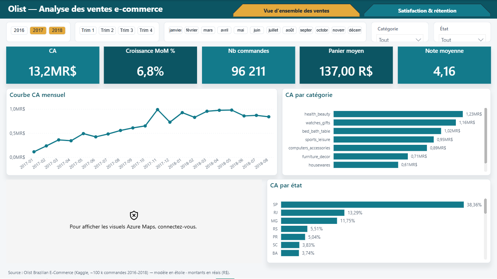
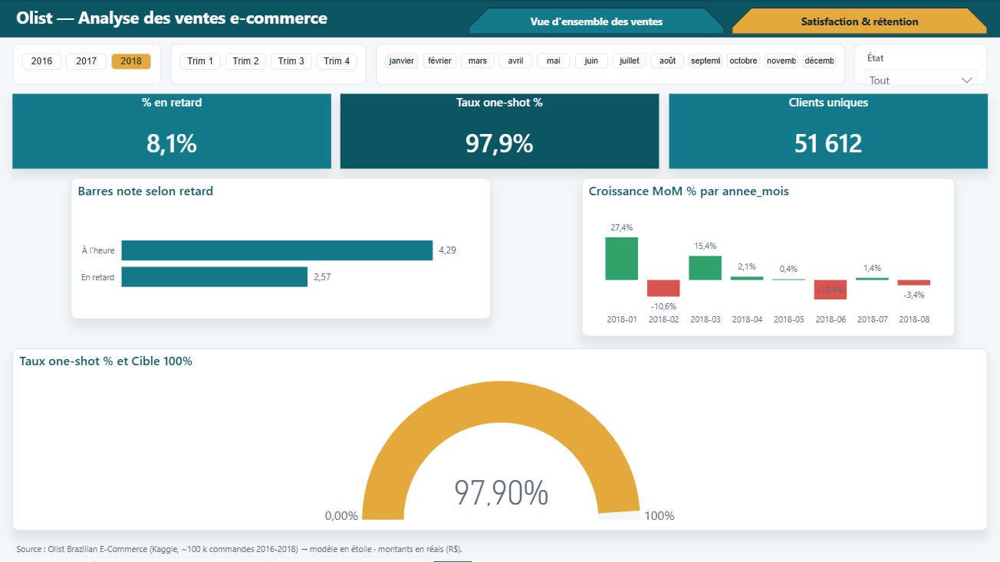
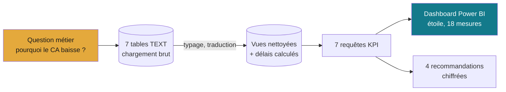

# Projet 01 — Analyse des ventes e-commerce (Olist)

> **« Les ventes ont chuté — pourquoi ? »** Le travail d'un Data Analyst ne commence
> pas par Excel mais par une **question métier**. Cette analyse part d'une baisse
> constatée, l'explique avec les données, et débouche sur des **recommandations
> chiffrées et actionnables**.

Données : **Olist Brazilian E-Commerce** (~100 k commandes, 2016-2018).

## 📸 Aperçu du dashboard

**Page 1 — Vue d'ensemble des ventes**


**Page 2 — Satisfaction & rétention**


## 🔎 Réponse en 4 points (voir [docs/insights.md](docs/insights.md))

1. **La baisse est réelle mais modérée** : pic à 978 k R$ (mai 2018), puis −14 %
   sur 3 mois. Le pic de nov. 2017 = Black Friday (saisonnalité).
2. **Ce n'est PAS un problème de qualité** : pendant la baisse, les délais se sont
   *raccourcis* (11 → 7,3 j) et la satisfaction est restée haute (~4,3/5).
3. **Le vrai gisement = la rétention** : **97 % des clients ne commandent qu'une
   fois**. L'activité repose entièrement sur l'acquisition.
4. **Deux autres leviers** : forte dépendance à São Paulo (**38 % du CA**) ; et le
   **retard de livraison fait chuter la note à 2,57/5** (vs 4,29 à l'heure).

## 🧱 Démarche


```mermaid
flowchart LR
    Q["Question métier<br/>pourquoi le CA baisse ?"] --> RAW[("7 tables TEXT<br/>chargement brut")]
    RAW -->|typage, traduction| CLEAN[("Vues nettoyées<br/>+ délais calculés")]
    CLEAN --> KPI["7 requêtes KPI"]
    KPI --> DASH["Dashboard Power BI<br/>étoile, 18 mesures"]
    KPI --> REC["4 recommandations<br/>chiffrées"]

    style DASH fill:#137A8B,color:#fff
    style Q fill:#E4A93C,color:#1a1a1a
```

| Étape | Fichier | Ce qui est fait |
|---|---|---|
| Chargement brut | [`sql/01_schema.sql`](sql/01_schema.sql) | 7 tables Olist en TEXT (on ne fait pas confiance à la source) |
| Nettoyage & typage | [`sql/02_clean.sql`](sql/02_clean.sql) | vues typées : dates, montants, catégories traduites, **délais de livraison calculés** |
| Analyse KPI | [`sql/03_kpi.sql`](sql/03_kpi.sql) | 7 requêtes : CA mensuel + MoM, délais/satisfaction, impact retard, catégories, géo, rétention, panier moyen |
| Insights | [`docs/insights.md`](docs/insights.md) | note d'1 page + recommandations |

Compétences : SQL (jointures, fonctions fenêtres, agrégats conditionnels) ·
nettoyage de données réelles · construction de KPI · storytelling data.

## 🔬 Qualité des données (mesurée)

Audit exécuté directement sur les 7 tables brutes chargées (`sql/01_schema.sql`),
avant tout nettoyage — chiffres réels, pas des ordres de grandeur :

| Contrôle | Résultat mesuré | Verdict |
|---|---:|---|
| `orders` / `customers` — doublons de clé (`order_id`, `customer_id`) | 0 / 0 sur 99 441 lignes | ✅ propre |
| `order_items` — orphelins vers `orders` / `products` | 0 / 0 sur 112 650 lignes | ✅ propre |
| `order_items` — doublons (`order_id` + `order_item_id`) | 0 | ✅ propre |
| `order_items.price` ≤ 0 / `freight_value` < 0 | 0 / 0 | ✅ propre |
| `reviews.review_score` hors 1–5 ou non numérique | 0 sur 99 224 | ✅ propre |
| `products.product_category_name` NULL | 610 / 32 951 (1,9 %) | ⚠️ géré (fallback) |
| Catégories produit sans traduction anglaise | 2 (`pc_gamer`, `portateis_cozinha_e_preparadores_de_alimentos`) | ⚠️ géré (fallback) |
| `reviews.review_comment_message` vide | 58 247 / 99 224 (58,7 %) | ℹ️ normal (facultatif côté client) |
| `orders` au statut `delivered` sans `order_delivered_customer_date` | 8 | ⚠️ incohérence connue, non corrigée |
| `orders` sans aucune ligne dans `payments` | 1 | ⚠️ incohérence connue, non corrigée |
| `payments.payment_value` ≤ 0 | 9 | ⚠️ incohérence connue, non corrigée |
| `orders` livrée avant la date d'achat | 0 | ✅ propre |

## 🧱 Pièges identifiés et corrigés

- **Catégorie produit absente ou non traduite** : `v_products`
  (`sql/02_clean.sql`) applique `COALESCE(traduction_en, nom_brut, 'unknown')` —
  les 610 produits sans catégorie tombent sur `'unknown'`, les 2 catégories non
  traduites gardent leur nom portugais brut plutôt que de disparaître ou de
  planter la vue.
- **Client dupliqué en apparence** : `customer_id` n'a aucun doublon, mais
  99 441 `customer_id` ne pointent que vers **96 096 `customer_unique_id`**
  distincts — Olist génère un nouveau `customer_id` par commande. Toute
  analyse de rétention doit agréger sur `customer_unique_id`, pas
  `customer_id` (c'est ce que fait `docs/insights.md` — sinon le taux de
  clients "un seul achat" serait artificiellement gonflé).
- **`delivered` sans date de livraison** : `v_orders` calcule `delivered_at`,
  `delay_days` et `is_late` via `NULLIF(...)::timestamp` — pour les 8
  commandes concernées, ces colonnes deviennent `NULL` plutôt qu'une fausse
  valeur (ex. un retard de 0 jour qui laisserait croire à une livraison à
  l'heure). Elles sont donc naturellement exclues des KPI de délai/retard,
  sans traitement spécifique nécessaire.
- **Restant en l'état** (portée volontairement non traitée dans ce projet) :
  9 paiements à valeur ≤ 0 et 1 commande sans aucun paiement associé — trop
  marginal (10 lignes sur ~100 k) pour justifier une vue dédiée, mais
  documenté ici plutôt que silencieusement ignoré.

## 🚀 Reproduire

Prérequis : PostgreSQL (le conteneur Docker du [Projet 07](https://github.com/valentinratigniet-byte/projet-07-base-ecommerce), port 5433) + un compte Kaggle.

```bash
# 1. Télécharger les données Olist (nécessite ~/.kaggle/kaggle.json)
pip install kaggle
kaggle datasets download -d olistbr/brazilian-ecommerce -p data --unzip

# 2. Charger + nettoyer + analyser
docker exec -i p07_ecommerce_db psql -U portfolio -d ecommerce < sql/01_schema.sql
# charger les CSV (server-side \copy : les fichiers doivent être dans le conteneur, ex. docker cp vers /tmp)
for f in customers orders order_items products; do
  docker cp "data/olist_${f}_dataset.csv" p07_ecommerce_db:/tmp/
done
docker cp data/olist_order_reviews_dataset.csv p07_ecommerce_db:/tmp/
docker cp data/olist_order_payments_dataset.csv p07_ecommerce_db:/tmp/
docker cp data/product_category_name_translation.csv p07_ecommerce_db:/tmp/
# \copy est une méta-commande psql : elle ne passe pas par -c, il faut un fichier/stdin
cat > /tmp/load_olist.sql << 'EOF'
\copy olist.customers from '/tmp/olist_customers_dataset.csv' with (format csv, header true)
\copy olist.orders from '/tmp/olist_orders_dataset.csv' with (format csv, header true)
\copy olist.order_items from '/tmp/olist_order_items_dataset.csv' with (format csv, header true)
\copy olist.products from '/tmp/olist_products_dataset.csv' with (format csv, header true)
\copy olist.reviews from '/tmp/olist_order_reviews_dataset.csv' with (format csv, header true)
\copy olist.payments from '/tmp/olist_order_payments_dataset.csv' with (format csv, header true)
\copy olist.category_translation from '/tmp/product_category_name_translation.csv' with (format csv, header true)
EOF
docker exec -i p07_ecommerce_db psql -U portfolio -d ecommerce < /tmp/load_olist.sql
docker exec -i p07_ecommerce_db psql -U portfolio -d ecommerce < sql/02_clean.sql
docker exec -i p07_ecommerce_db psql -U portfolio -d ecommerce < sql/03_kpi.sql
```

## 📊 Dashboard

Dashboard **`dashboard-olist.pbix`** : modèle en étoile (`olist.bi_*`), 18 mesures
DAX, jauge de rétention, carte du Brésil, identité « Petrol & Ambre »
(`portfolio-theme.json`). Modèle entièrement documenté (in-situ) — dictionnaire :
[docs/data-dictionary.md](docs/data-dictionary.md).

## 📄 Données & licence

Dataset **Olist** via Kaggle — licence **CC BY-NC-SA 4.0**. Les CSV ne sont pas
versionnés (voir `.gitignore`) ; utilise le script de téléchargement ci-dessus.
Attribution : *Olist, Brazilian E-Commerce Public Dataset (Kaggle)*.

---

*Projet 01 du [Portfolio Data](https://github.com/valentinratigniet-byte). Étude métier de bout en bout sur données réelles.*
